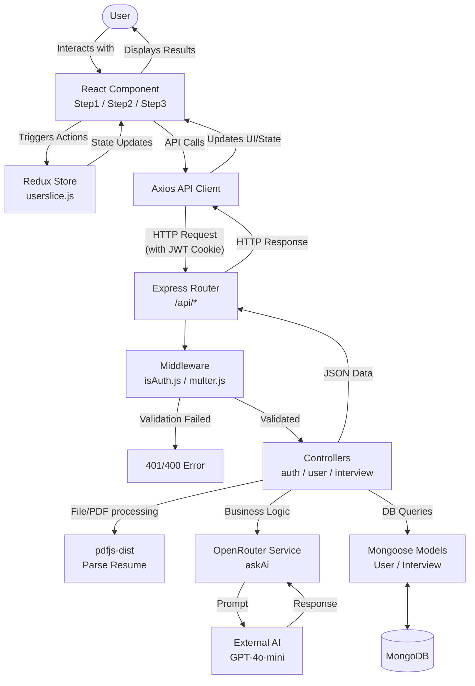
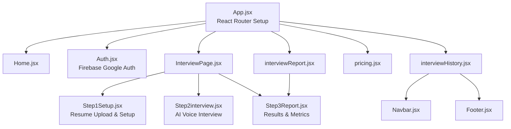

# HirePrep-AI: System Architecture & Complete Codebase Documentation

Welcome to the definitive, exhaustive documentation for **HirePrep-AI**. This document breaks down the High-Level Design (HLD), Low-Level Design (LLD), API infrastructure, and provides a comprehensive file-by-file, function-by-function analysis for both the frontend (`client`) and backend (`server`) codebases.

---

## 1. High-Level Design (HLD) & System Architecture

HirePrep-AI is built on the MERN stack (MongoDB, Express.js, React, Node.js) infused with advanced AI capabilities via OpenRouter API and browser-based Speech-to-Text (Web Speech API) / Text-to-Speech (Web Speech Synthesis). 

### Architecture Overview

1. **Client Layer (Vite + React + Tailwind + Framer Motion):** Handles UI rendering, video playback, voice recognition, and state management via Redux Toolkit.
2. **Gateway / Network Layer (Axios):** Communicates with the backend RESTful APIs securely using HTTP-only cookies for JWT-based authentication.
3. **API & Business Logic Layer (Node + Express):** Handles routing, JWT validation, PDF parsing (pdf.js), cloud file storage configurations, and prompts construction.
4. **AI Layer (OpenRouter / GPT-4o-mini):** Processes the interview prompts, evaluates user answers, and generates interview questions.
5. **Data Layer (MongoDB + Mongoose):** Stores user profiles, credits, and historical interview data.

### System Request-Response Lifecycle Flowchart



---

## 2. Low-Level Design (LLD) & Component Architecture

### Client (`client/`) Architecture
The frontend follows a feature-centric structure driven by React Router. State management is minimal but crucial, relying on Redux for tracking the authenticated user and credits across the application.

#### Component Hierarchy Diagram



### Server (`server/`) Architecture
The backend strictly adheres to the Model-Route-Controller (MRC) pattern augmented with Services and Middlewares.

- **Routes (`server/routes/`):** Defines HTTP endpoints and binds them to middlewares and controllers.
- **Middlewares (`server/middlewares/`):** Intercepts requests (e.g., `isAuth.js` decrypts JWT cookies; `multer.js` handles form-data file uploads locally).
- **Controllers (`server/controllers/`):** Contains the core orchestration logic (e.g., reading a PDF, calling the AI service, calculating scores, updating the DB).
- **Services (`server/services/`):** Encapsulates 3rd-party API integrations (`openRouter.service.js`).
- **Models (`server/models/`):** Mongoose schemas defining MongoDB collections (`usermodel.js`, `interview.model.js`).

---

## 3. Exhaustive API & Endpoint Documentation

All endpoints are prefixed with `/api`. The base URL dynamically points to localhost or the deployed Render instance.

### Auth Routes (`/api/auth`)

#### `POST /google`
- **Description:** Authenticates the user via Google. Creates a new user if they don't exist. Generates a JWT and sets it as an HTTP-only cookie.
- **Middleware:** None.
- **Controller:** `googleAuth`
- **Request Body:** `{ "name": "John Doe", "email": "john@example.com" }`
- **Response (200):** User document JSON. Sets `token` cookie.

#### `GET /logout`
- **Description:** Clears the authentication JWT cookie.
- **Middleware:** None.
- **Controller:** `logout`
- **Response (200):** `{ "message": "Logout Successfully" }`

### User Routes (`/api/user`)

#### `GET /current-user`
- **Description:** Fetches the currently authenticated user's profile and credits.
- **Middleware:** `isAuth`
- **Controller:** `getCurrent`
- **Response (200):** User document JSON.

### Interview Routes (`/api/interview`)

#### `POST /resume`
- **Description:** Uploads and parses a resume PDF. Uses AI to extract role, experience, projects, and skills.
- **Middleware:** `isAuth`, `upload.single("resume")` (Multer)
- **Controller:** `analyzeResume`
- **Request Payload:** `multipart/form-data` with `resume` file.
- **Response (200):** `{ "role": "...", "experience": "...", "projects": [...], "skills": [...], "resumeText": "..." }`

#### `POST /generate-question`
- **Description:** Generates exactly 5 interview questions based on the candidate's profile and resume. Deducts 50 credits from the user.
- **Middleware:** `isAuth`
- **Controller:** `generateQuestion`
- **Request Body:** `{ "role": "...", "experience": "...", "mode": "...", "resumeText": "...", "projects": [], "skills": [] }`
- **Response (200):** `{ "interviewId": "...", "creditsLeft": 50, "userName": "...", "questions": [...] }`

#### `POST /submit-answer`
- **Description:** Evaluates a single answer submitted by the user. Assigns scores for confidence, communication, and correctness.
- **Middleware:** `isAuth`
- **Controller:** `submitAnswer`
- **Request Body:** `{ "interviewId": "...", "questionIndex": 0, "answer": "...", "timetaken": 45 }`
- **Response (200):** `{ "feedback": "..." }`

#### `POST /finish`
- **Description:** Finalizes the interview session, calculates the average score, updates the status, and returns the final report.
- **Middleware:** `isAuth`
- **Controller:** `finishInterview`
- **Request Body:** `{ "interviewId": "..." }`
- **Response (200):** `{ "totalQuestions": 5, "totalScore": 35, "averageScore": 7, "result": "Good", "questions": [...] }`

#### `GET /history`
- **Description:** Retrieves all previous interview sessions for the authenticated user, sorted by date.
- **Middleware:** `isAuth`
- **Controller:** `getMyInterview`
- **Response (200):** `[{ "role": "...", "experience": "...", "mode": "...", "finalScore": 8, "status": "Completed", "createdAt": "..." }]`

#### `GET /report/:id`
- **Description:** Retrieves the detailed report and breakdown of a specific interview by its ID.
- **Middleware:** `isAuth`
- **Controller:** `getInterviewReport`
- **Request Params:** `id` (Interview MongoDB ObjectId)
- **Response (200):** JSON containing `finalScore`, `totalScore`, `averageScore`, `confidence`, `communication`, `correctness`, and detailed `questions` array.

---

## 4. Comprehensive File & Function Reference

### Server Directory (`server/`)

#### 1. Entry Point
**`server/index.js`**
- **Purpose:** Bootstraps the Express application.
- **Functionality:** 
  - Loads environment variables.
  - Configures CORS for frontend-backend communication (with credentials enabled).
  - Mounts global middlewares (`express.json`, `cookie-parser`).
  - Calls `connectDb()` to establish MongoDB connection.
  - Mounts routes (`/api/auth`, `/api/user`, `/api/interview`).
  - Starts the server on `process.env.PORT`.

#### 2. Configuration (`server/config/`)
**`connectDb.js`**
- **Function:** `connectDb()`
- **Purpose:** Connects to MongoDB using Mongoose and `process.env.MONGODB_URL`. Exits process on failure.

**`token.js`**
- **Function:** `genToken(userId)`
- **Purpose:** Generates a signed JSON Web Token (JWT) encapsulating the `userId` using `jsonwebtoken`. Expires in 7 days.

#### 3. Middlewares (`server/middlewares/`)
**`isAuth.js`**
- **Function:** `isAuth(req, res, next)`
- **Purpose:** Extracts the `token` from `req.cookies`. Verifies it using `JWT_SECRET`. Appends the decoded `userId` to `req.user`. Denies access if invalid or missing.

**`multer.js`**
- **Export:** `upload`
- **Purpose:** Configures `multer` for local file uploads (specifically for parsing resumes).
- **Details:** 
  - Ensures the `uploads` directory exists asynchronously via `fs.existsSync`.
  - Defines `diskStorage` with unique filenames (`Date.now() + originalname`).
  - Implements a `fileFilter` to accept only `.pdf`, `.doc`, and `.docx` up to 5MB.

#### 4. Models (`server/models/`)
**`usermodel.js`**
- **Schema:** `User`
- **Fields:** `name` (String), `email` (String, Unique), `credits` (Number, default 100).
- **Purpose:** Stores user accounts.

**`interview.model.js`**
- **Schemas:** `questionSchema`, `interviewSchema`
- **`questionSchema`:** Tracks individual question text, difficulty, timeLimit, user's answer, AI feedback, score, confidence, communication, and correctness.
- **`interviewSchema`:** Links to `userId`. Tracks role, experience, mode (HR/Technical), resumeText, an array of `questions`, finalScore, and status (Incompleted/Completed).

#### 5. Services (`server/services/`)
**`openRouter.service.js`**
- **Function:** `askAi(messages)`
- **Purpose:** Interfaces directly with the OpenRouter API.
- **Input:** An array of message objects (`{ role, content }`).
- **Logic:** Makes an Axios POST request to `openrouter.ai/api/v1/chat/completions` using the `openai/gpt-4o-mini` model. Extracts and returns the generated content string. Handles errors gracefully.

#### 6. Controllers (`server/controllers/`)
**`auth.controller.js`**
- **`googleAuth(req, res)`**: Checks if a user exists by email. If not, creates one. Generates a token and attaches it to an HTTP-only cookie.
- **`logout(req, res)`**: Clears the `token` cookie.

**`user.controller.js`**
- **`getCurrent(req, res)`**: Uses `req.user` (from `isAuth`) to query the database and return the user's data.

**`interview.controllers.js`**
- **`safeJsonParse(text, fallback)`**: Helper to safely strip Markdown backticks and parse AI JSON responses.
- **`analyzeResume(req, res)`**: Reads the uploaded file using `fs`, parses the PDF using `pdfjs-dist`, and sends the raw text to OpenRouter to extract structured data (Role, Experience, Projects, Skills). Deletes the file afterward.
- **`generateQuestion(req, res)`**: Validates credits (needs 50). Constructs a prompt detailing the user's resume, skills, and mode. Requests 5 interview questions of varying difficulty from AI. Deducts credits and creates an `Interview` DB record.
- **`submitAnswer(req, res)`**: Fetches the interview. Checks time taken against limits. Prompts the AI to evaluate the answer and return a JSON containing confidence, communication, correctness, and feedback. Updates the DB.
- **`finishInterview(req, res)`**: Averages the scores of all 5 questions. Assigns a text result ("Excellent", "Average", etc.), marks status as "Completed", and saves.
- **`getMyInterview(req, res)`**: Fetches all interviews for `req.user`, sorted descending by creation date.
- **`getInterviewReport(req, res)`**: Fetches a single interview by ID. Calculates aggregated averages for confidence, communication, and correctness to display in the frontend report.

#### 7. Routes (`server/routes/`)
- **`authRoute.js`**: Maps `/google` and `/logout`.
- **`user.route.js`**: Maps `/current-user` to `getCurrent` via `isAuth`.
- **`interviewRouter.js`**: Maps `/resume`, `/generate-question`, `/submit-answer`, `/finish`, `/history`, and `/report/:id`.

---

### Client Directory (`client/src/`)

#### 1. Setup & Configuration
**`main.jsx`**
- **Purpose:** Standard React entry point. Wraps the app in `Provider` (Redux) and `BrowserRouter` (React Router).

**`App.jsx`**
- **Purpose:** Application root and router definitions.
- **Logic:** Triggers a `useEffect` on mount to fetch `/api/user/current-user` from the backend and updates the Redux store. Contains `<Routes>` mapping to Pages.

#### 2. Utilities & State
**`utils/firebase.js`**
- **Purpose:** Initializes Firebase App and sets up `GoogleAuthProvider` for authentication.

**`redux/store.js` & `redux/userslice.js`**
- **Purpose:** Basic Redux Toolkit setup.
- **State:** Tracks `userData` globally so the Navbar and Interview gates know if the user is authenticated and how many credits they have.

#### 3. Pages (`client/src/utils/pages/`)
**`Home.jsx`** *(Note: File logic inferred from standard routing, typical landing page)*.
- **Purpose:** Landing page marketing the product.

**`Auth.jsx`**
- **Purpose:** Authentication UI. 
- **Logic:** Uses Firebase `signInWithPopup`. Upon success, sends the Google email/name to the backend `/api/auth/google` to obtain the JWT cookie. Updates Redux.

**`interviewPage.jsx`**
- **Purpose:** Parent container for the interview flow.
- **State:** Manages the `step` (1, 2, or 3) and `interviewData` passed between steps.
- **Renders:** `Step1Setup`, `Step2interview`, or `Step3Report` dynamically.

**`interviewHistory.jsx`**
- **Purpose:** Dashboard showing past interviews.
- **Logic:** Fetches `/api/interview/history`. Calculates aggregate metrics (Avg Score, Total Sessions). Maps data to cards displaying the mode, status, and score. Provides links to specific reports.

**`interviewReport.jsx`**
- **Purpose:** Wrapper to display a specific report via URL parameters (`?id=...`).
- **Logic:** Fetches `/api/interview/report/:id` and passes the data down to the `Step3Report` component.

**`pricing.jsx`**
- **Purpose:** UI for displaying credit packages.

#### 4. Components (`client/src/components/`)
**`Step1Setup.jsx`**
- **Purpose:** Interview initialization form.
- **Logic:** 
  - Allows users to drag-and-drop a Resume. Calls `/api/interview/resume` to auto-fill the form (Role, Experience).
  - Users select Interview Mode (HR/Technical).
  - Calls `/api/interview/generate-question` to start. Sets `interviewData` and moves parent to Step 2.

**`Step2interview.jsx`** (The Core Interactive Component)
- **Purpose:** AI Voice Interview interface.
- **Key Features:**
  - **Text-to-Speech (TTS):** Uses `window.speechSynthesis` with dynamic male/female voice selection based on the assigned AI persona. Reads questions and feedback aloud.
  - **Speech-to-Text (STT):** Uses `window.SpeechRecognition` (Webkit) for continuous voice input. Tracks word count.
  - **Video Syncing:** Plays loopable AI videos (`female-ai.mp4` / `male-ai.mp4`). Pauses video when the user is speaking. Shows visual waveforms.
  - **Timer & Auto-Submit:** Runs a `setInterval` timer based on question difficulty. If time expires, auto-submits the answer.
  - **Fallback Questions:** Contains hardcoded `ADVANCED_FALLBACK_QUESTIONS` in case the AI returns less than 5 questions.
  - **State Machine:** Moves through phases: `intro` (Self Introduction) -> `interview` (Questions 1-5).
  - **API Integration:** Calls `/submit-answer` after every question. Calls `/finish` after question 5.

**`Step3Report.jsx`**
- **Purpose:** Analytical dashboard for interview results.
- **Logic:** 
  - Receives `report` JSON. 
  - Calculates specific aggregated stats (average confidence, communication, correctness).
  - Uses SVGs and Framer Motion for rich, animated circular progress indicators and bar charts.
  - Generates a downloadable PDF of the report using `jspdf`.

**`Navbar.jsx` & `Footer.jsx`**
- **Purpose:** Standard layout components. Navbar reacts to Redux state to show login/logout states and credit balance.

---

## 5. Setup, Configuration & Execution

To run this project locally, follow these precise steps.

### Environment Variables

**Server (`server/.env`)**
Create a `.env` file in the `server` directory:
```env
PORT=8000
MONGODB_URL=mongodb+srv://<your_user>:<your_password>@cluster.mongodb.net/hireprep?retryWrites=true&w=majority
JWT_SECRET=your_super_secret_jwt_key
OPENROUTER_API_KEY=your_openrouter_api_key
```

**Client (`client/.env`)**
Create a `.env` file in the `client` directory:
```env
VITE_FIREBASE_API_KEY=your_firebase_api_key
```
*(Ensure Firebase config in `utils/firebase.js` matches your Firebase project settings).*

### Terminal Commands & Execution

Open your terminal at the root of the project (`HirePrep-AI`).

**1. Install Backend Dependencies:**
```bash
cd server
npm install
```

**2. Install Frontend Dependencies:**
```bash
cd ../client
npm install
```

**3. Run the Backend (Dev Mode):**
```bash
cd ../server
npm run dev
```
*(The server will start on `http://localhost:8000` via nodemon).*

**4. Run the Frontend (Concurrent Terminal):**
Open a new terminal window/tab:
```bash
cd client
npm run dev
```
*(Vite will serve the client, typically on `http://localhost:5173`).*

**Important Note for Local Dev:** 
In `client/src/App.jsx` and `client/src/utils/pages/Auth.jsx`, ensure `ServerUrl` is set to `http://localhost:8000` (it is currently hardcoded to Render in some places for production). The backend `cors` configuration in `server/index.js` must also include `http://localhost:5173` in its allowed origins if running locally.
