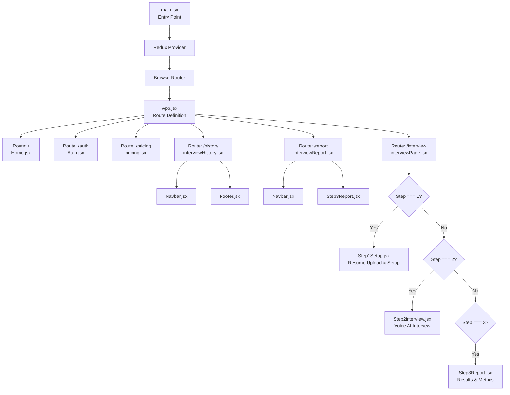
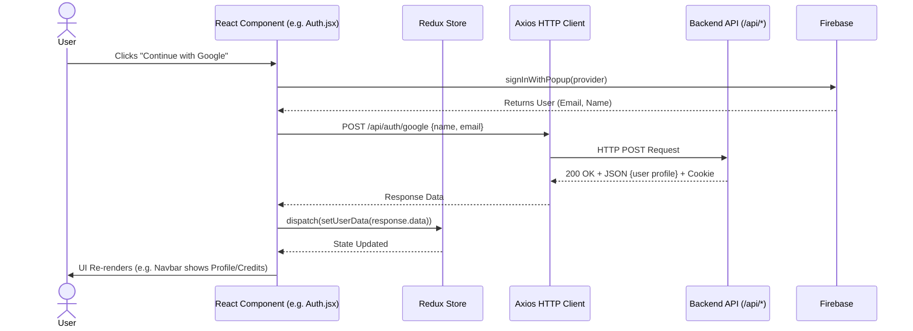

# HirePrep-AI: Frontend Architecture & UI Documentation

Welcome to the definitive frontend documentation for **HirePrep-AI**. This document provides an exhaustive breakdown of the High-Level Design (HLD), Component Architecture, State Management flow, and a comprehensive file-by-file analysis of the React/Vite codebase residing in the `client` directory.

---

## 1. High-Level Design (HLD) & Component Architecture

The frontend of HirePrep-AI is a modern Single Page Application (SPA) built with **React** and bundled using **Vite**. It utilizes **Tailwind CSS** for rapid, utility-first styling and **Framer Motion** for fluid, complex animations. The application is strictly modular, dividing concerns into globally accessible pages, reusable UI components, centralized Redux state, and configuration utilities.

### Component Tree Architecture

The component hierarchy is managed by React Router v7 (`react-router-dom`). `App.jsx` acts as the root orchestrator, determining which top-level Page component renders based on the URL.



---

## 2. State Management & Data Flow (LLD)

HirePrep-AI utilizes **Redux Toolkit** for predictable state management. The state is kept intentionally lightweight, focusing primarily on tracking the authenticated user's session and credit balance across the application. 

- **Actions:** Actions are dispatched using `useDispatch()` (e.g., `setUserData(data)`).
- **Reducers:** The `userSlice` handles state mutations for `userData`.
- **Selectors:** Components read the state using `useSelector((state) => state.user.userData)`.

### Data Flow Sequence Diagram

The following diagram illustrates a typical user interaction flow, from clicking a button, through the backend API, to a Redux state update and UI re-render.



---

## 3. API Integration & Routing

### Routing (`App.jsx`)
React Router is used to map paths to specific page components stored in `src/utils/pages/`.
- `/` -> `<Home />`
- `/auth` -> `<Auth />`
- `/interview` -> `<InterviewPage />` (Multi-step interactive process)
- `/history` -> `<InterviewHistory />`
- `/pricing` -> `<Pricing />`
- `/report` -> `<InterviewReport />`

### API Integration (`Axios`)
The frontend communicates with the backend via **Axios**. 
- The base URL is explicitly defined in `App.jsx` as `export const ServerUrl = "http://localhost:8000";` (for local development) or the Render production URL. 
- Crucially, every Axios request passes `{ withCredentials: true }`. This configuration is required so the browser attaches the HTTP-only JWT token cookie to outgoing requests to authenticate the user session automatically.

---

## 4. Comprehensive File & Function Reference

### 4.1 Entry Point & Routing
#### `src/main.jsx`
- **Purpose:** The React initialization script.
- **Functionality:** Injects the React tree into the `#root` DOM element. Wraps the entire application in `<Provider store={store}>` (for Redux) and `<BrowserRouter>` (for React Router v7). 

#### `src/App.jsx`
- **Purpose:** The primary routing layout and global state initializer.
- **State/Hooks:** Uses `useEffect` on component mount.
- **Line-by-Line / Lifecycle:**
  1. Calls `useEffect` on first render.
  2. Executes an async `axios.get` to `ServerUrl + "/api/user/current-user"` with credentials.
  3. If a valid user is returned, dispatches `setUserData(result.data)` to hydrate Redux.
  4. If it fails (e.g., no cookie or expired), dispatches `setUserData(null)`.
  5. Renders a `<Routes>` block mapping URLs to Page components.

### 4.2 State Management (`src/redux/`)
#### `redux/store.js`
- **Purpose:** Configures the Redux store.
- **Functionality:** Uses `@reduxjs/toolkit` `configureStore`. Combines reducers, assigning the `userSlice` to the `user` key in the global state object.

#### `redux/userslice.js`
- **Purpose:** The slice governing user authentication and profile data.
- **State:** `initialState` defines `userData: null`.
- **Reducers:**
  - `setUserData`: Updates `state.userData` directly with `action.payload`.
- **Exports:** The action creator `setUserData` and the default reducer.

### 4.3 Utilities (`src/utils/`)
#### `utils/firebase.js`
- **Purpose:** Configures Firebase for OAuth (Google Sign-In).
- **Functionality:** 
  1. Initializes the Firebase app using `apiKey: import.meta.env.VITE_FIREBASE_API_KEY`.
  2. Exports the `auth` instance (`getAuth(app)`) and the `provider` instance (`new GoogleAuthProvider()`) for use in `Auth.jsx`.

### 4.4 Pages (`src/utils/pages/`)
#### `utils/pages/Home.jsx` *(Inferred structure)*
- **Purpose:** The landing page displaying the product's value proposition.
- **Renders:** Hero section, feature breakdowns, and CTA buttons linking to `/auth` or `/interview`.

#### `utils/pages/Auth.jsx`
- **Purpose:** Handles Google OAuth sign-in and sign-up.
- **State/Hooks:** Uses `useDispatch` to update Redux.
- **Function `handleGoogleAuth`:** 
  1. Calls Firebase `signInWithPopup(auth, provider)`.
  2. Extracts `name` and `email` from the Firebase response.
  3. Sends a POST request to `/api/auth/google`.
  4. Dispatches the resulting user profile to Redux.
- **JSX Rendered:** A visually appealing, animated card (via Framer Motion) containing a "Continue with Google" button.

#### `utils/pages/interviewPage.jsx`
- **Purpose:** A container mapping a multi-step wizard for the interview flow.
- **State:** `step` (number: 1, 2, or 3) and `interviewData` (object).
- **Lifecycle & Render Logic:**
  - `step === 1`: Renders `<Step1Setup onStart={(data) => { setInterviewData(data); setStep(2) }} />`.
  - `step === 2`: Renders `<Step2interview interviewData={interviewData} infinish={(report) => { setInterviewData(report); setStep(3) }} />`.
  - `step === 3`: Renders `<Step3Report report={interviewData} />`.

#### `utils/pages/interviewHistory.jsx`
- **Purpose:** A dashboard displaying all past interview sessions for the user.
- **State/Hooks:** `interviews` (array), `loading` (boolean), `error` (string).
- **Lifecycle:** `useEffect` fetches `/api/interview/history`.
- **Logic:** 
  - Calculates derived state: `avgScore` and `completed` count.
  - Maps over the `interviews` array to render summary cards (Role, Date, Final Score, Status).
  - Includes a "View Report" button that navigates to `/report?id=[id]`.

#### `utils/pages/interviewReport.jsx`
- **Purpose:** A wrapper page for viewing a specific interview's detailed results.
- **State/Hooks:** Uses `useSearchParams` to extract `?id=...`. `report` (object), `loading` (boolean), `error` (string).
- **Lifecycle:** `useEffect` triggers whenever `id` changes. Fetches `/api/interview/report/[id]`.
- **JSX Rendered:** Displays loading spinners or error messages. On success, renders the `<Step3Report report={report} />` component.

#### `utils/pages/pricing.jsx` *(Inferred structure)*
- **Purpose:** Displays credit package tiers and handles checkout flows for users needing more credits to generate interviews.

### 4.5 Core Components (`src/components/`)
#### `components/Step1Setup.jsx`
- **Purpose:** The configuration form before an interview begins.
- **State:** `role`, `experience`, `mode`, `resume` (File), `resumeText`, `skills`, `projects`, `analyzing`, `loading`.
- **Function `handleResumeUpload`:** 
  1. Validates file size (5MB) and type.
  2. Sets `analyzing = true`.
  3. Uses `FormData` to post the file to `/api/interview/resume`.
  4. Auto-fills form state (`role`, `experience`, `skills`, etc.) from the AI response.
- **Function `handleStart`:** Validates inputs, posts to `/api/interview/generate-question`, updates the user's Redux credit balance, and triggers the `onStart` prop.
- **JSX Rendered:** Form inputs, dropzone for resume upload, dynamic skill/project tags, and a submission button.

#### `components/Step2interview.jsx`
- **Purpose:** The highly interactive, AI-driven voice interview interface. This is the most complex component in the app.
- **Core Integrations:**
  - **Web Speech Synthesis API (TTS):** Used via `createSpeakText` to vocalize questions and feedback using a selected male/female browser voice.
  - **Web Speech Recognition API (STT):** Captures user's spoken answers continuously via `startListening`. Updates `interimText` and `answer` state.
- **State:** 
  - `phase` (`"intro"` or `"interview"`).
  - `currentIndex` (tracks which question is active).
  - `timeLeft` (countdown timer in seconds).
  - `isListening`, `isSpeaking`, `videoPaused`.
- **Lifecycle & Concept Logic:**
  - **On Mount:** The AI greets the user via TTS and asks for an introduction (`intro` phase).
  - **Intro Submission:** Submitting the intro switches the `phase` to `interview`.
  - **Question Cycle Effect:** When `currentIndex` changes, the component resets the timer, clears the answer text, speaks the new question, and starts a `setInterval` timer.
  - **Auto-Submit:** If `timeLeft` hits 0, `handleAutoSubmit` triggers, stopping speech recognition and automatically grading the answer.
  - **Manual Submit (`handleSubmit`):** Posts the answer text and time taken to `/api/interview/submit-answer`. Receives and displays AI feedback, parsing the score (0-10) using Regex (`parseScore`).
  - **Progression (`handleNext`):** Advances `currentIndex` or, if all 5 questions are done, calls `/api/interview/finish` and triggers the `infinish` prop to move to Step 3.
- **JSX Rendered:** Split layout. Left panel features looping video (`female-ai.mp4` / `male-ai.mp4`), animated waveform bars, AI captions, and progress indicators. Right panel contains a text area, a countdown timer SVG, and action buttons (Speak/Mute, Skip, Submit).

#### `components/Step3Report.jsx`
- **Purpose:** Data visualization dashboard for a completed interview.
- **State/Hooks:** Relies primarily on the passed `report` object prop. Uses `jsPDF` for PDF generation.
- **Concept Logic:** 
  - Iterates over the 5 questions to calculate aggregate averages for Confidence, Communication, and Correctness.
  - Renders custom `<CircleScore />` and `<ScoreBar />` sub-components using SVG math to draw dynamic, colorful circular progress rings based on scores out of 10.
  - Generates a PDF via `downloadPDF()` which maps over questions using `doc.text()` and `doc.addPage()` to export results locally.
- **JSX Rendered:** A grid of scorecards, progress bars for detailed metrics, and a mapped list of accordion-style breakdowns for each individual question (displaying the user's answer, AI feedback, and micro-metrics).

#### `components/Navbar.jsx` & `components/Footer.jsx` *(Inferred structure)*
- **Purpose:** Application shell UI.
- **Navbar:** Subscribes to Redux `userData`. If null, shows Login. If populated, shows user name/avatar and current credit balance.

---

## 5. Setup, Configuration & Execution

To run the frontend locally, follow these precise steps.

### Environment Variables

In the `client` directory, create a `.env` file containing the required keys for Vite and Firebase.

```env
# Firebase Configuration for Authentication
VITE_FIREBASE_API_KEY=your_actual_firebase_api_key_here
```

*Note: Ensure the base URL in `client/src/App.jsx` (`ServerUrl`) points to `http://localhost:8000` for local development, as Vite runs on a different port than Express.*

### Terminal Commands

Open your terminal at the root of the project (`HirePrep-AI`).

**1. Navigate to the client directory:**
```bash
cd client
```

**2. Install Frontend Dependencies:**
*(This installs `react`, `react-dom`, `react-router-dom`, `@reduxjs/toolkit`, `axios`, `firebase`, `framer-motion`, `jspdf`, `tailwindcss`, and `@vitejs/plugin-react`)*
```bash
npm install
```

**3. Run the Vite Development Server:**
```bash
npm run dev
```

You should see terminal output indicating Vite has started successfully:
```text
  VITE v5.x.x  ready in 300 ms

  ➜  Local:   http://localhost:5173/
  ➜  Network: use --host to expose
```
Navigate to `http://localhost:5173` in your browser to access the application.
